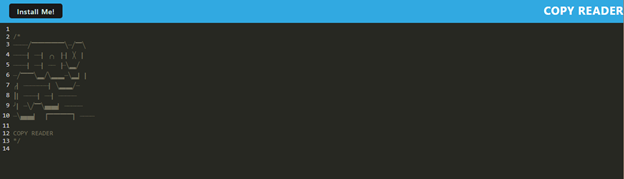

# CopyReader

## Table of Contents

[Description](#description)

[Acceptance Criteria](#acceptance-criteria)

[Links to Project](#links-to-project)

[Screenshot of Project](#screenshot-of-project)

[Technology](#technology)

[Questions](#questions)

## Description

The goal of this challenge is to build text editor that runs in the browser. The app will be a single-page application that meets the PWA criteria and function offline.

## Acceptance Criteria

```md
GIVEN a text editor web application
WHEN I open my application in my editor
THEN I should see a client server folder structure
WHEN I run `npm run start` from the root directory
THEN I find that my application should start up the backend and serve the client
WHEN I run the text editor application from my terminal
THEN I find that my JavaScript files have been bundled using webpack
WHEN I run my webpack plugins
THEN I find that I have a generated HTML file, service worker, and a manifest file
WHEN I use next-gen JavaScript in my application
THEN I find that the text editor still functions in the browser without errors
WHEN I open the text editor
THEN I find that IndexedDB has immediately created a database storage
WHEN I enter content and subsequently click off of the DOM window
THEN I find that the content in the text editor has been saved with IndexedDB
WHEN I reopen the text editor after closing it
THEN I find that the content in the text editor has been retrieved from our IndexedDB
WHEN I click on the Install button
THEN I download my web application as an icon on my desktop
WHEN I load my web application
THEN I should have a registered service worker using workbox
WHEN I register a service worker
THEN I should have my static assets pre cached upon loading along with subsequent pages and static assets
WHEN I deploy to Heroku
THEN I should have proper build scripts for a webpack application
```

## Links to Project

[Depolyed URL to Project](https://nameless-caverns-42444.herokuapp.com/)

[GitHub URL to Project](https://github.com/idakukimiya/CopyReader)

## Screenshot of Project



## Technology

* indexedDB database

* npm package call idb (lightweight wrapper around the IndexedDB API)

* Heroku deployment

## Questions

  Please contact me using the following links:

  [GitHub](https://github.com/https://github.com/idakukimiya)

  [Email: kukimiya.ida@gmail.com](mailto:kukimiya.ida@gmail.com)
